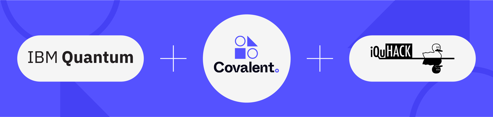

# MIT iQuHACK 2023 - Covalent x IBM Challenge



Welcome to the MIT iQuHack2023 Challenge for those looking to access MIT at visitors for the challenge please visit [here](https://tim-tickets.atlas-apps.mit.edu/J7xSzY7VtAm1JUT4A).

In order to gain access to IBM Quantum hardware:

1. Create IBM Cloud account
2. Send a message with the email address you used above to the #ibm channel to the [iQuHack Slack](iquhack.slack.com)
3. You should recieve an email that you've been added to the `IBM Quantum` Project

## Overview

Quantum Computers can enable special applications, yet these applications are predominantly leveraged by academics and large institutions where everyday consumers of the internet or mobile applications are typically quite separated from utilizing quantum computers in one form or another.

This challenge aims to design and build a cloud-based, quantum-powered application that addresses a real-world problem and is accessible to end users. This includes applications of quantum algorithms that can have practical usage and, in theory, be exposed to businesses or individual users on the internet for consumption. Teams should identify a problem that can be solved (not necessarily more efficiently) with quantum computers.

Some examples include but are not limited to:

- An application involving a Random Number Generator
- An application involving Optimization
- An application involving Chemical Simulation
- An application involving a Quantum Calculator
- An application involving Sentiment Analysis
- An application involving Image Classification
- A game involving a quantum algorithm

> Note: The idea is that it serves a practical use case and can be accessed by anyone without special tooling that is not already included in a typical out-of-the-box computer installation (or minimal installation)

## Requirements

The required components of your project are:

- UI, API, CLI, or some accessible interface. Designing the user interface for their application, taking into account the needs and preferences of end users.
- Covalent*
- Web Hosted (or internet-exposed proxy to local computer)
- Uses IBM Quantum Nairobi system (or Oslo as a backup)

> *Your program does not necessarily need to invoke covalent workflows for each end-user request; it can be a one-off process (for example, training a model, then publishing a model to S3 where other workflows can later be used to serve requests using hybrid hardware)


## **Judging criteria**

1. **Technical Aspects (30%)** : This category includes the following subcategories:
    - Quantum Complexity : How complex is the quantum algorithm? How optimized is it?
    - Architecture : Does the architecture leverage cloud technologies to optimize cost? Can the architecture serve users at a reasonable scale?
    - Accessibility/User Experience : How accessible is the end user application? Is it easy to use and intuitive for end users?
2. **Originality and Uniqueness (25%)** : How unique is this project compared to others? How interesting is it? Did the team attempt something new or difficult?
3. **Usefulness and Complexity (25%)** : How useful is the project and how well-designed is it? How functional is it at the time of judging? Can it be used in real-world business applications or serve as a valuable tool for individuals?
4. **Presentation (20%)** : How well did the team represent their project? Were they able to explain their decisions? Did the entire team have a chance to speak?

## More About Covalent

Covalent is a Pythonic workflow tool for computational scientists, AI/ML software engineers, and anyone who needs to run experiments on limited or expensive computing resources including quantum computers, HPC clusters, GPU arrays, and cloud services.

To get started with covalent visit our [Github repo](https://github.com/AgnostiqHQ/covalent) or our [Quick Start Guide](https://covalent.readthedocs.io/en/latest/getting_started/quick_start/index.html).

Our compatibility guide is available [here](https://covalent.readthedocs.io/en/latest/getting_started/compatibility.html?highlight=compatibility). If you are using windows please see the below note. 
> Note: Covalent is not currently compatible with windows however can still be used with the Linux Subsystem. Windows users will find Debian or Ubuntu distros to be a good choice for use with Covalent & convenient to install using the [Windows Subsystem for Linux (WSL)](https://learn.microsoft.com/en-us/windows/wsl/about), which is [now available from the Microsoft store](https://devblogs.microsoft.com/commandline/the-windows-subsystem-for-linux-in-the-microsoft-store-is-now-generally-available-on-windows-10-and-11/). See [Installing Debian on WSL](https://wiki.debian.org/InstallingDebianOn/Microsoft/Windows/SubsystemForLinux) or [Install Ubuntu on WSL](https://ubuntu.com/tutorials/install-ubuntu-on-wsl2-on-windows-11-with-gui-support#1-overview).

It is particularly recommended to check out our tutorial for MIT QuHack for a full guide on using covalent.
- [MIT QuHack Tutorial](workshop/MIT%20QuHack.ipynb)


Running a covalent workflow is as easy as installing with pip and starting covalent:

```bash
$ pip install covalent
$ covalent start
```

To convert your python script to a covalent workflow simply add decorators to your python functions:

<table style='margin-left: auto; margin-right: auto; word-wrap: break-word;'>
<tr>
<th style='text-align:center;'>Without Covalent</th>
<th style='text-align:center;'>With Covalent (workflow.py)</th>
</tr>
<tr>
<td valign="top">

``` python
def add(x, y):
   return x + y

def multiply(x, y):
   return x*y

def divide(x, y):
   return x/y

def workflow(x, y):
   r1 = add(x, y)
   r2 = [multiply(r1, y) for _ in range(4)]
   r3 = [divide(x, value) for value in r2]
   return r3

result = workflow(1,2)
```
</td>
<td valign="top">


```python
import covalent as ct

@ct.electron
def add(x, y):
   return x + y

@ct.electron
def multiply(x, y):
   return x*y

@ct.electron
def divide(x, y):
   return x/y

@ct.lattice
def workflow(x, y):
   r1 = add(x, y)
   r2 = [multiply(r1, y) for _ in range(4)]
   r3 = [divide(x, value) for value in r2]
   return r3

dispatch_id = ct.dispatch(workflow)(1, 2)
result = ct.get_result(dispatch_id,wait=True)
```
</td>
</tr>
<tr>
<td valign="top">

```python
>>> print(result)
[0.16666666666666666, 0.16666666666666666, ...]
```
</td>
<td valign="top">

```python
>>> print(result.result)
[0.16666666666666666, 0.16666666666666666, ...]
```
</td>
</tr>
</table>

Simply run your workflow as:

```bash
$ python workflow.py
```

You should see your result on your shell or you can navigate to the covalent UI [http://localhost:48008](http://localhost:48008)


### AWS Account Setup

In order to interact with AWS services from your machine you must:

1. Have an AWS Account (Free): https://aws.amazon.com/free/
2. Install the AWS CLI: https://docs.aws.amazon.com/cli/latest/userguide/getting-started-install.html

Furthermore, if you don't already have one you will need to create an account. Once you are logged in you will want to go to IAM and then to Manage Security Credentials to obtain an `aws_access_key_id` and `aws_secret_access_key`. At which point you will need to store your credentials locally by using the cli:

```bash
$ aws configure
```

Alternatively you can go to `~/.aws/credentials` and create a section:

```
[default]
aws_access_key_id=<ACCESS_KEY>
aws_secret_access_key=<SECRET_ACCESS_KEY>
```

### AWS Executor Plugins

Covalent can also execute tasks remotely in environments with desired compute resources or hardware. This may include GPUs, QPUs and more compute for QPU simulators.

Using executors is as simple as installing a plugin and adding the `executor` keyword argument to the `@ct.electron` decorator.

```python
@ct.electron(
    executor=executor
)
def compute_pi(n):
    # Leibniz formula for π
    return 4 * sum(1.0/(2*i + 1)*(-1)**i for i in range(n))
```

Check out our guide on using [AWS Executor Plugins](https://covalent.readthedocs.io/en/latest/api/executors/awsplugins.html) for a full example and installation guide.

#### Important! Since this task is now executing remotely we will need to install all dependencies required for each task

```python
@ct.electron(deps_pip=ct.DepsPip(packages=["numpy==1.23.2"]))
def my_task():
    return np.random.rand(3,2)
```

Setting up executors also requires one to create the necessary AWS resources and configure executors to reference these created resources. This can be error prone at times so it is recommended to use the covalent self-hosted (as described in the below section) to facilitate the deployment and usage of AWS executors.

### Self Hosting

If you wish to share a runing server of covalent with your team or want to facilitate the usage of the AWS executor plugins it is recommended that you host covalent on AWS.

In order to deploy the self-hosted instance of covalent we will require Terraform in order to programatically create AWS Resources such as VMs (EC2) instances, and other resources required for using the AWS Executors.

Deploying covalent on AWS is as easy as running a few commands. Please see our guide below for self-hosting covalent.
- https://github.com/AgnostiqHQ/covalent-terraform
- [Video Walk through of the deployment](https://drive.google.com/file/d/17WJkdptcF1X-AnyoJjdlBb_yKubtJmEf/view?usp=sharing)

> Note: You will need to have Terraform installed on your machine

After the deployment is complete the output of the terraform script should give you URL to access the covalent server. Covalent can be configured to point to this new server via:

```python
import covalent as ct

ct.set_config("dispatcher.address", "<URL_FROM_TERRAFORM>")
ct.set_config("dispatcher.port", "48008")
```

From hereon you can dispatch workflows as before and they should now be running remotely on the newly provisioned covalent server!

#### Important! Since now covalent is now running remotely we will need to install all dependencies required for each task

```python
@ct.electron(deps_pip=ct.DepsPip(packages=["numpy==1.23.2"]))
def my_task():
    return np.random.rand(3,2)
```

Furthermore, executor plugins on remote covalent are pre-configured so they can be referred to simply as:

```python
@ct.electron(executor="awsbatch")
def my_batch_task():
    pass
```

The following are supported executors on hosted covalent:

- AWS Batch used as `"awsbatch"`
- AWS Lambda used as `"awslambda"`
- AWS Braket used as `"braket"`

#### Important! To use Amazon Braket in a new account you must visit
- https://console.aws.amazon.com/braket/home?#/permissions?tab=executionRoles
To create a service-linked role

### More Resources

For more examples using covalent see below for a list of tutorials:

- [Classical and quantum support vector machines](https://covalent.readthedocs.io/en/latest/tutorials/1_QuantumMachineLearning/classical_quantum_svm/source.html)
- [Using Covalent with PennyLane for hybrid computation](https://covalent.readthedocs.io/en/latest/tutorials/1_QuantumMachineLearning/pennylane_hybrid/source.html)
- [MNIST classifier tutorial](https://covalent.readthedocs.io/en/latest/tutorials/0_ClassicalMachineLearning/mnist_images/source.html)
- [Iris Classification](https://covalent.readthedocs.io/en/latest/tutorials/1_QuantumMachineLearning/pennylane_iris_classification/source.html)
- [Training quantum embedding kernels for classification](https://covalent.readthedocs.io/en/latest/tutorials/1_QuantumMachineLearning/quantum_embedding_kernel/source.html)
- [Simulating the Nitrogen-Copper interaction](https://covalent.readthedocs.io/en/latest/tutorials/3_QuantumChemistry/nitrogen_copper_interaction/source.html)

## Documentation

This year’s iQuHACK challenges require a write-up/documentation portion that is heavily considered during
judging. The write-up is a chance for you to be creative in describing your approach and describing
your process. It can be in the form of a blog post, a short YouTube video or any form of
social media. It should clearly explain the problem, the approach you used, your implementation with results
from simulation and hardware, and how you accessed the quantum hardware (total number of shots used, 
backends used, etc.).

Make sure to clearly link the documentation into the `README.md` and to include a link to the original challenge 
repository from the documentation!


## Submission

To submit the challenge, do the following:
1. Place all the code you wrote in one folder with your team name under the `team_solutions/` folder (for example `team_solutions/quantum_team`).
2. Create a new entry in `team_solutions.md` following the format shown that links to the folder with your solution and your documentation.
3. Create a Pull Request from your repository to the original challenge repository
4. Submit the "challenge submission" form

Project submission forms will automatically close on Sunday at 10am EST and won't accept late submissions.
