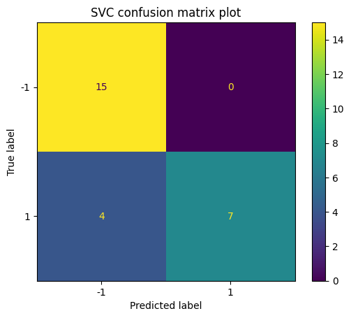
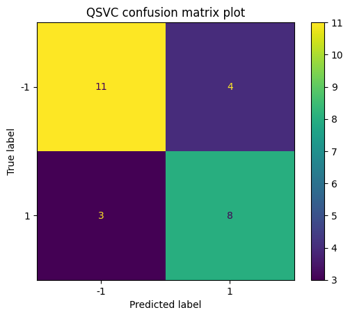

# Quantum Kernel Methods for Real-World Data
 **Authors:** Wei-Ting Chiu, Sudatta Hor, Marley Xiong, Chelsea Zackey

We present an experimental & educational attempt at using quantum-enhanced kernel methods to perform supervised learning on real-world data problems. Quantum kernel methods enable us to map data into higher dimensional feature spaces, inducing previously inaccessible topologies unto our datasets that are hard to simulate classically. In fact, for a certain class of learning problems, the us of quantum kernel methods give us a provable advantage over classical methods, making classically intractable problems solvable (see https://arxiv.org/abs/2105.03406).

Though we do not assert that all (or even most) real-world datasets fall into the category of learning problems mentioned above, there remains an outstanding question how far we can push the bounds of applicability of these methods, which we aim to explore here and present to end-users. Though we start off with the simple problem of spam detection in user mail, the intention was to later enable the user to apply and explore these methods to even more meaningful applications, such as natural disaster management (https://medium.com/qiskit/exploring-quantum-versus-classical-machine-learning-methods-for-disaster-management-aa58d6a3ee68), medical diagnoses, and much more.

## Instructions
  
  **Training** - Run `python train.py`, which executes a Covalent workflow to train and store the models in `models/`.
  
  **Running** - Run `python web2.py`, which will launch a dash web application. Paste your email message in the box and hit submit to use the model to predict if it is spam or not.

## Technical Aspects

We train our model for the supervised learning task using the UCI Spambase dataset (https://archive.ics.uci.edu/ml/datasets/spambase). We train with both classical SVC and quantum SVC. For the quantum SVC, we utilize the quantum kernel method with ZZFeatureMap to encode the data. Then, the kernel is sent to a classical computer for regression. The results are shown below, where the QSVC shows comparable performance to the classical result.

## Future Directions
As mentioned above, although the use of quantum kernel methods has a demonstrable advantage over classical methods for learning problems involving data endowed with group structure, real life can't always be idealized in such a convenient way; however, the original publication suggests some promise that quantum kernel methods can still be used meaningfully to learn about certain datasets in the presence of a marginal degree of error (https://arxiv.org/abs/2105.03406). In this spirit, we feel it would be interesting to further explore the use of these methods for the following applications/research: 
